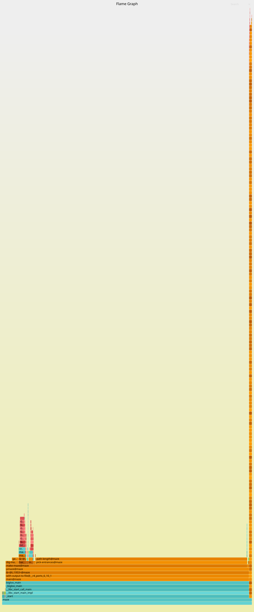

<!--==================================================================-->
<!--    serrano/prgm/project/bigloo/5.0a/doc/c.md                     -->
<!--    ----------------------------------------------------------    -->
<!--    Author      :  manuel serrano                                 -->
<!--    Creation    :  Mon Apr 13 10:38:02 2026                       -->
<!--    Last change :                                                 -->
<!--    Copyright   :  2026 manuel serrano                            -->
<!--    -----------------------------------------------------------   -->
<!--    Profiling                                                     -->
<!--==================================================================-->

Profiling
=========

> [!WARNING] The facility described in this chapter is only available
> for the Linux and C backend.

Bigloo can take benefit of the Linux profiling system to profile execution.
It requires an operational `perf` installation. This standard Linux tool
reports execution profiling using textual format that in conjunction with
the [`bgldemangle`](./demangle.html) tool can be used to produce easy
to read Bigloo report.

In addition to the bare Linux's `perf` tool, Bigloo also ships some
script perl inspired from
[FlameGraphs](http://www.brendangregg.com/FlameGraphs/cpuflamegraphs.html)
that produces textual or graphical visualization of the executions.


Plain Perf Profiling
--------------------

Let us assume the Bigloo benchmark maze that exercises the garbage collector
and integer arithmetic. The profiling of this program can be achieved with:

```shell
bigloo -Ox -unsafe -cg maze.bgl -o maze
perf record ./a.out
perf report --stdio | demangle
```

Addition the `-cg` flag is important as it will instruct the C compiler
to include a symbol table in the binary file that `perf` could use.

This will produce a report such as:

```shell
    86.22%  maze     maze               [.] pick-entrances@maze
     4.75%  maze     maze               [.] dig-maze@maze.isra.0
     1.16%  maze     maze               [.] for-each-hex-child@maze.isra.0
     1.03%  maze     maze               [.] GC_mark_from
     0.86%  maze     maze               [.] GC_build_fl
     0.84%  maze     maze               [.] permute-vec!@maze
     0.44%  maze     maze               [.] GC_clear_stack_inner
     0.41%  maze     maze               [.] modulofx@__r4_numbers_6_5_fixnum
     0.41%  maze     maze               [.] bgl_display_char
     0.39%  maze     maze               [.] GC_malloc_kind
     0.39%  maze     maze               [.] print-hexmaze@maze.isra.0
     0.34%  maze     maze               [.] GC_allochblk_nth
     0.29%  maze     maze               [.] bgl_fill_vector
     0.29%  maze     maze               [.] bgl_list_length
     0.29%  maze     maze               [.] make-wall-vec@maze
     0.24%  maze     maze               [.] list->vector@__r4_vectors_6_8
     0.23%  maze     maze               [.] make_vector
     0.19%  maze     maze               [.] make_pair
     ...
```

Bglperf
-------

Bigloo also the `bglperf` script, which is a wrapper on top of `perf`
and that, by using a couple of perl scripts, produces other representations
of the execution, in particular flame graphs. It supports three profiling
modes:

  * `--text`: a mere wrapper to `perf report`;
  * `--graph`: report a call graph profiling;
  * `--flame`: produces an interactive SVG graph of the call graph.
  



